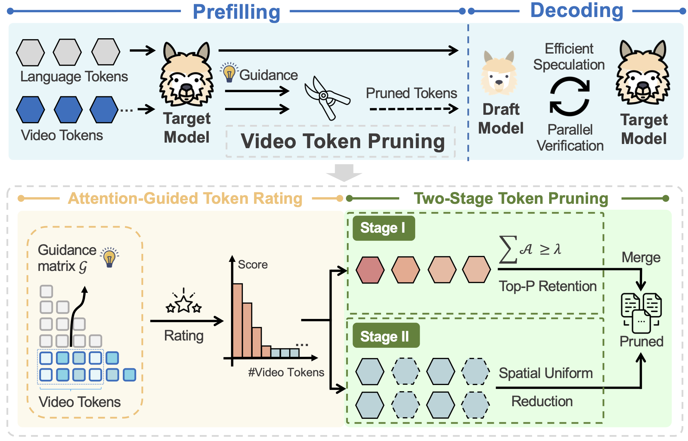

<div align="center">
<h1>
      
    <br>  
    <em>SpecVLM</em>  
    <br>  
</h1>

<p align="center">
<a href="https://openreview.net/forum?id=mWElG6fKEN">
  </a> 
<a href="https://opensource.org/licenses/Apache-2.0">
  </a> 
<a href="https://github.com/zju-jiyicheng/SpecVLM/pulls">
    </a>
</p>

<h2 style="color: #6a5acd; font-weight: bold;">
🚀 2.68× Decoding Speedup with 90% Token Reduction ⬇️
</h2>

</div>

Yicheng Ji*, Jun Zhang*, Heming Xia, Jinpeng Chen, Lidan Shou, Gang Chen, Huan Li (* equal contribution)


## 📌  Overview
<p align="center">
  
</p>

## Publication
[EMNLP 2025 Main] SpecVLM: Enhancing Speculative Decoding of Video LLMs via Verifier-Guided Token Pruning
🔗 [arXiv 2508.16201](https://www.arxiv.org/abs/2508.16201)


## 📖 Abstract
Video large language models (Vid-LLMs) have shown strong capabilities in understanding video content. However, their reliance on dense video token representations introduces substantial memory and computational overhead in both prefilling and decoding. To mitigate the information loss of recent video token reduction methods and accelerate the decoding stage of Vid-LLMs losslessly, we introduce SpecVLM, a training-free speculative decoding (SD) framework tailored for Vid-LLMs that incorporates staged video token pruning. Building on our novel finding that the draft model’s speculation exhibits low sensitivity to video token pruning, SpecVLM prunes up to 90% of video tokens to enable efficient speculation without sacrificing accuracy. To achieve this, we perform a two-stage pruning process: Stage I selects highly informative tokens guided by attention signals from the verifier (target model), while Stage II prunes the remaining redundant ones in a spatially uniform manner. Extensive experiments on four video understanding benchmarks demonstrate the effectiveness and robustness of SpecVLM, which achieves up to 2.68× decoding speedup for LLaVA-OneVision-72B and 2.11× speedup for Qwen2.5-VL-32B.  

---

## ⚙️ Environment Setup

Install the required dependencies:
```bash
conda create -n SpecVLM python==3.10 -y
conda activate SpecVLM
pip install torch torchvision
pip install -r requirements.txt
```


## 🛠 Download Models & Datasets
- For LLaVA-OneVision models: https://huggingface.co/llava-hf
- For Qwen2.5-VL models: https://huggingface.co/Qwen 
- For VideoDetailCaption dataset: https://huggingface.co/datasets/lmms-lab/VideoDetailCaption


## 🚀 Quick Evaluation
Run the demo script to quickly evaluate SpecVLM:
```bash
sh run.sh
```
Please also moderate the model path, data path, pruning ratio, and frame number in run.sh file.

After runing the script, the evaluation result will be stored in results/.

## Note
- Our method primarily targets resource-constrained long-video scenarios, where GPU memory bandwidth constitutes the main bottleneck during inference. Users are advised to set the input length according to GPU capacity. Theoretically, as frame number grows, SpecVLM achieves higher acceleration ratios.
- In principle, our approach is lossless, with only minimal impact introduced by the attention implementation and data type settings.

## Citation
If you find SpecVLM useful or relevant to your research, please kindly cite our papers:
```bash
@inproceedings{ji2025SpecVLM,
  title     = {SpecVLM: Enhancing Speculative Decoding of Video LLMs via Verifier-Guided Token Pruning},
  author    = {Yicheng Ji and Jun Zhang and Heming Xia and Jinpeng Chen and Lidan Shou and Gang Chen and Huan Li},
  booktitle = {The 2025 Conference on Empirical Methods in Natural Language Processing},
  year      = {2025},
  url       = {https://openreview.net/forum?id=mWElG6fKEN}
}
```
